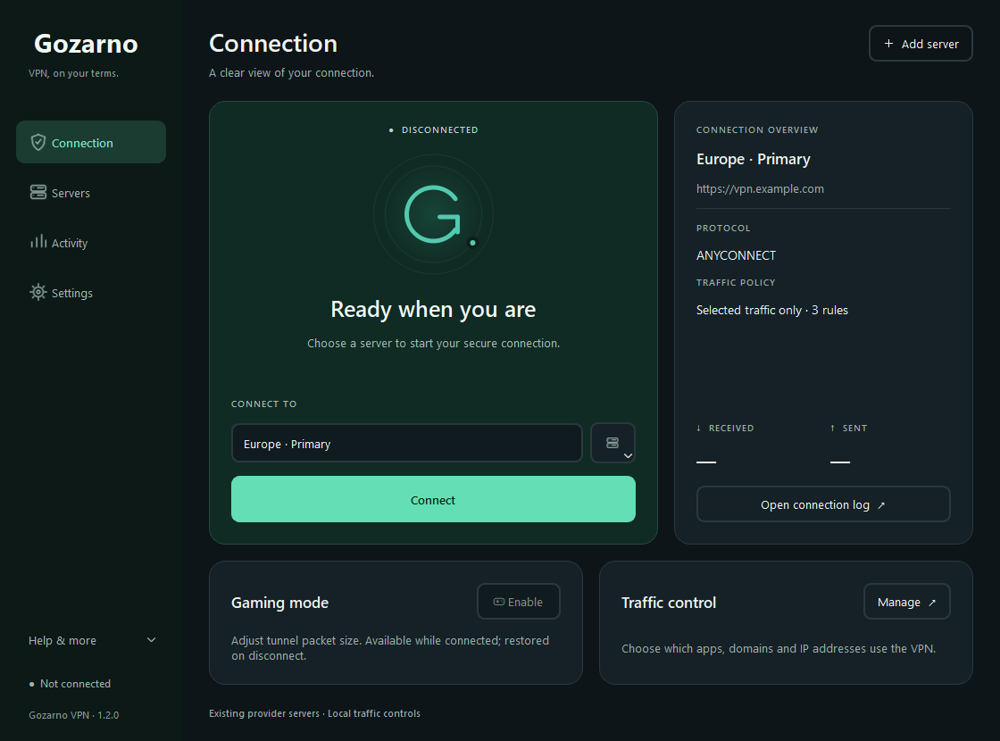

# Gozarno VPN

Independent Windows client based on OpenConnect GUI, with a redesigned desktop
interface, server library, optional Windows-encrypted credentials, local traffic
rules and reversible tunnel MTU gaming mode. Existing provider servers require
no updates. This build is a development preview.

Gozarno is maintained in [withcerAi/gozarno](https://github.com/withcerAi/gozarno).
It derives from [OpenConnect GUI](https://github.com/openconnect/openconnect-gui),
whose current upstream development is hosted on
[GitLab](https://gitlab.com/openconnect/openconnect-gui).
Original authors' credits and the GPL license are retained.

English is the default interface language; Persian with right-to-left layout is
available in Settings. Windows x64 is the target of this fork's packaged builds.
Source and build instructions are published alongside the client; generated
packages belong in GitHub Releases, not the source repository.

## Code signing status

The current self-signed test package is not publicly trusted. Gozarno has not
been accepted by SignPath Foundation and does not yet provide releases signed
by that service. Private signing keys are never part of this repository.

See [features, build and validation](docs/client-modernization.md),
[UI review](docs/ui-review.md), and [third-party/source notices](docs/third-party.md).

## English interface

The screenshot uses fictional example profiles and shows the disconnected state.

## Upstream OpenConnect GUI

This is the development space of OpenConnect VPN graphical client (GUI).
See the [OpenConnect VPN GUI web site](https://gui.openconnect-vpn.net/)
for detailed description, screen shots and other related projects.

## Goals of this client

The goal is to have a simple / minimalistic interface to access
enterprise VPN services. Non technical audience is the focus; anyone
should be able to use it.

For contributions we follow:
https://developer.apple.com/design/human-interface-guidelines
where it applies.

### Main tasks

These tasks are a click away:

 - Connecting to a new server
 - Connecting to an existing server
 - Disconnecting
 - View log

### Security

As non-technical audience is the focus of this client it is imperative
that security decisions are not delegated to the user unless absolutely
necessary.

#### Server certificate validation

Historically the SSL VPN servers openconnect works with, had certificates with
incorrect hostnames in them, and were not in the Internet PKI. For that the
way openconnect gui works is
 1. Try Internet PKI validation - if successful server is validated
 2. Fallback to SSH-type authentication where the server public key must remain
    unchanged.

## Supported Platforms
- Microsoft Windows 10 and newer
- macOS 10.12 and newer

## Development info
- [Compilation](docs/dev.md)
- [Development with QtCreator](docs/dev_QtCreator.md)

## Other
- [Creating release package](docs/release.md)
- [OpenConnect library compilation and dependencies](docs/openconnect.md)
- [Web page maintenance](https://gitlab.com/openconnect/openconnect-gui-web)
- [Snapshot builds](docs/snapshots.md)
- [AppVeyor CI builds](https://ci.appveyor.com/project/nmav/openconnect-gui/history)

# License
The content of this project itself is licensed under the [GNU General Public License v2](LICENSE.txt)
